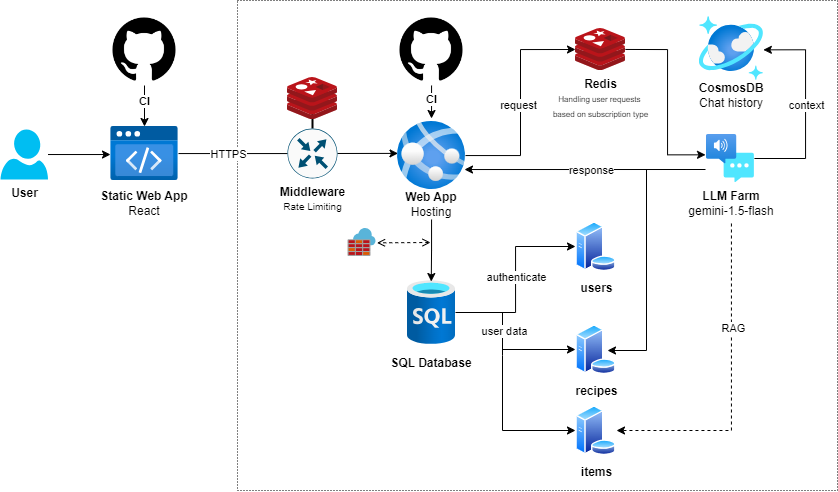

  

  <h3 align="center">FoodFusion AI</h3>

  

    Open Source groceries management with AI (LLMs).
      
    <a><strong>Try here:</strong></a>
     
     
    <a href="TODO">Download on Android</a>
    ·
    <a href="TODO">Website</a>
  

 

## Demo

TODO insert demo video

 

---

  

## 🌟 Features

- **User profile**: Consideration of preferences, diets and allergies
- **Automated shopping list**: Dynamic generation and customisation based on stocks and recipes
- **Recipes**: Suggestions based on current stocks, seasonal food, allergies and more 
- **Reminders**: Reminds you if food is about to expire

Availabe on **Android** and on the **web**

 
[]here link to website)

  

## ⚙️ Tech stack

### 🧠 LLM
- **Model**: Gemini 1.5 Flash 

- **Embeddings model**: models/text-embedding-004

### 🖥️ Backend
  

 

- **Python>=3.10**

  
- **Frameworks**:

  
  
  

- **Cloud Platform**:
    | Service | Purpose | |
    | ----------- | ----------- | ----------- |
    | **Azure Web App** | 	API & backend logic |  |
    | **Azure CosmosDB** | LLM chat history storage	|  |
    | **Azure SQL Database** | User & groceries table	|  |
    
### 🛡️ Security

#### Secured API endpoints
All FastAPI endpoints are protected by security measures:
- **Authentication and authorisation**: Only authenticated users can access protected resources (OAuth2, JWT)

#### Protection of the user data

The user database is additionally protected by several layers of security:
- **Firewall**: The Azure database is configured by a firewall that only allows access from trusted IP addresses
- **Data encryption**: All data in the database is encrypted to ensure the highest level of data security

### 🎨 Frontend
Find anything related to the frontend here:

https://github.com/FrameworkV/FoodFusionAI-Website

https://github.com/FrameworkV/FoodFusionAI-App